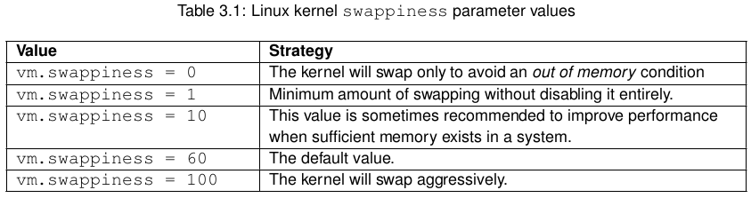

Host System Administration
==========================

Proxmox VE se basa en la famosa distribución Debian Linux. Eso significa que tienes acceso a la Todo el mundo de los paquetes de Debian, y el sistema base está bien documentado. El administrador de Debian El manual está disponible en línea y proporciona una introducción completa al sistema operativo Debian.
Una instalación estándar de Proxmox VE utiliza los repositorios predeterminados de Debian, por lo que obtiene correcciones de errores y Actualizaciones de seguridad a través de ese canal. Además, proporcionamos nuestro propio repositorio de paquetes para implementar todo Proxmox VE paquetes relacionados. Esto incluye actualizaciones de algunos paquetes de Debian cuando sea necesario.
También entregamos un kernel de Linux especialmente optimizado, donde habilitamos toda la virtualización y el contenedor requeridos.
caracteristicas. Ese núcleo incluye controladores para ZFS y varios controladores de hardware. Por ejemplo, enviamos Intel
controladores de tarjeta de red para soportar su hardware más nuevo.
Las siguientes secciones se concentrarán en temas relacionados con la virtualización. O bien explican cosas que son diferente en Proxmox VE, o tareas que se usan comúnmente en Proxmox VE. Para otros temas, por favor consulte a la documentación estándar de Debian.

3.1 Package Repositories
+++++++++++++++++++++++++

Todos los sistemas basados ​​en Debian utilizan APT como herramienta de gestión de paquetes. La lista de repositorios se define en /
Los archivos /etc/apt/sources.list y .list se encuentran en /etc/apt/sources.d/. Las actualizaciones pueden ser instaladas directamente con apt-get, o mediante la GUI.
Los archivos Apt sources.list enumeran un repositorio de paquetes por línea, con la fuente más preferida en primer lugar.
Las líneas vacías se ignoran, y un carácter # en cualquier lugar de una línea marca el resto de esa línea como comentadas.
La información disponible de las fuentes configuradas es adquirida por apt-get update.

**File /etc/apt/sources.list** ::

	deb http://ftp.debian.org/debian stretch main contrib
	# security updates
	deb http://security.debian.org stretch/updates main contrib

3.1.1 Proxmox VE Enterprise Repository
++++++++++++++++++++++++++++++++++++++

Este es el repositorio predeterminado, estable y recomendado, disponible para todos los usuarios de suscripción de Proxmox VE. Eso
Contiene los paquetes más estables y es adecuado para uso de producción. El repositorio pve-enterprise está habilitado por defecto::

	deb https://enterprise.proxmox.com/debian/pve stretch pve-enterprise

Tan pronto como las actualizaciones estén disponibles, el usuario root@pam recibirá una notificación por correo electrónico sobre el nuevo paquete disponible.
En la GUI, se puede ver el registro de cambios de cada paquete (si está disponible), mostrando todos los detalles del
actualizar. Para que nunca te pierdas las importantes correcciones de seguridad.
Tenga en cuenta que necesita una **clave de suscripción** válida para acceder a este repositorio. Ofrecemos soporte diferente.
niveles, y puede encontrar más detalles en http://www.proxmox.com/en/proxmox-ve/pricing.

Nota
	Puede deshabilitar este repositorio comentando la línea anterior usando un # (al comienzo de la línea). Esto evita los mensajes de error si no tiene una clave de suscripción. Por favor, configure el pve-no-repositorio de suscripción en ese caso.

**File /etc/apt/sources.list** ::

	deb http://ftp.debian.org/debian stretch main contrib
	# PVE pve-no-subscription repository provided by proxmox.com,
	# NOT recommended for production use
	deb http://download.proxmox.com/debian/pve stretch pve-no-subscription
	# security updates
	deb http://security.debian.org stretch/updates main contrib

3.1.3 Proxmox VE Test Repository
++++++++++++++++++++++++++++++++

Finalmente, hay un repositorio llamado pvetest. Este contiene los últimos paquetes y es muy utilizado por Desarrolladores para probar nuevas funcionalidades. Como de costumbre, puede configurar esto usando /etc/apt/sources.list por añadiendo la siguiente línea::

	deb http://download.proxmox.com/debian/pve stretch pvetest

Advertencia
	el repositorio pvetest debería (como su nombre lo indica) solo debe usarse para probar nuevas funciones o errores arreglos.

3.1.4 SecureApt
+++++++++++++++++

Usamos GnuPG para firmar los archivos de lanzamiento dentro de esos repositorios, y APT usa esas firmas para verificar que todos los paquetes son de una fuente confiable La clave utilizada para la verificación ya está instalada si la instala desde nuestro CD de instalación. Si lo instalas por otro significa, puede descargar manualmente la clave con::

	# wget http://download.proxmox.com/debian/proxmox-ve-release-5.x.gpg -O /etc/apt/trusted.gpg.d/proxmox-ve-release-5.x.gpg

checksum::

	# sha512sum /etc/apt/trusted.gpg.d/proxmox-ve-release-5.x.gpg
	ffb95f0f4be68d2e753c8875ea2f8465864a58431d5361e88789568673551501ae574283a4e0492f17d
	/etc/apt/trusted.gpg.d/proxmox-ve-release-5.x.gpg

o::

	# md5sum /etc/apt/trusted.gpg.d/proxmox-ve-release-5.x.gpg
	511d36d0f1350c01c42a3dc9f3c27939 /etc/apt/trusted.gpg.d/proxmox-ve-release-5.x.gpg

3.2 System Software Updates
++++++++++++++++++++++++++++

Ofrecemos actualizaciones regulares de paquetes en todos los repositorios. Puede instalar esas actualizaciones utilizando la GUI, o
Puede ejecutar directamente el comando CLI apt-get::

	apt-get update
	apt-get dist-upgrade

Debe realizar dichas actualizaciones a intervalos regulares o cuando publiquemos versiones con correcciones relacionadas con la seguridad.
Las principales actualizaciones del sistema se anuncian en el Foro Comunitario de Proxmox VE. Esos anuncios también contienen instrucciones detalladas de actualización.

Tips
	Recomendamos ejecutar actualizaciones regulares, porque es importante obtener las últimas actualizaciones de seguridad.

3.3 Network Configuration
+++++++++++++++++++++++++++

La configuración de la red se puede realizar a través de la GUI o editando manualmente el archivo /etc/network/interfaces, que contiene toda la configuración de la red. Las interfaces (5) página de manual.
Contiene la descripción completa del formato. Todas las herramientas Proxmox VE se esfuerzan por mantener las modificaciones directas del usuario,
pero el uso de la GUI es aún preferible, ya que lo protege de los errores.
Una vez que la red está configurada, puede utilizar los comandos ifup y ifdown de las herramientas tradicionales de Debian para
traer interfaces hacia arriba y hacia abajo.

Nota
	Proxmox VE no escribe cambios directamente en /etc/network/interfaces. En su lugar, escribimos en un archivo temporal llamado /etc/network/interfaces.new, y confirme esos cambios cuando reinicie el nodo.

3.3.1 Naming Conventions
+++++++++++++++++++++++++

Actualmente utilizamos las siguientes convenciones de nombres para los nombres de dispositivos:
• Dispositivos Ethernet: en *, nombres de interfaz de red systemd. Este esquema de denominación se utiliza para el nuevo Proxmox.
Instalaciones de VE desde la versión 5.0.
• Dispositivos Ethernet: eth[N], donde 0 ≤ N (eth0, eth1, ...) Este esquema de denominación se utiliza para Proxmox VE
Los hosts que se instalaron antes de la versión 5.0. Cuando se actualiza a 5.0, los nombres se mantienen como están.
• Nombres de puentes: vmbr[N], donde 0 ≤ N ≤ 4094 (vmbr0 - vmbr4094)
• Bonos: bond[N], donde 0 ≤ N (enlace0, enlace1, ...)
• VLAN: Simplemente agregue el número de VLAN al nombre del dispositivo, separados por un período (eno1.50, bond1.
30)
Esto facilita la depuración de problemas de redes, ya que el nombre del dispositivo implica el tipo de dispositivo.

Systemd Network Interface Names
+++++++++++++++++++++++++++++++

Systemd usa el prefijo de dos caracteres en para dispositivos de red Ethernet. Los siguientes personajes dependen de la controlador de dispositivo y el hecho de que el esquema coincide primero.
• o<index> [n<phys_port_name> | d<dev_port>] - dispositivos a bordo
• s<slot> [f<function>] [n<phys_port_name> | d<dev_port>] - dispositivo por id de hotplug
• [P<dominio>] p<bus> s<slot> [f<function>] [n<phys_port_name> | d<dev_port>] - dispositivos por ID de bus
• x <MAC> - dispositivo por dirección MAC
Los patrones más comunes son:
• eno1 - es el primer NIC a bordo
• enp3s0f1: es la NIC en la ranura 0 de pcibus 3 y usa la función NIC 1.
Para obtener más información, consulte Nombres de interfaz de red predecibles.

3.3.2 Choosing a network configuration
+++++++++++++++++++++++++++++++++++++++

Dependiendo de su organización de red actual y sus recursos, puede elegir entre un puente, enrutado, o enmascarar la configuración de red.

**Servidor Proxmox VE en una LAN privada, utilizando una puerta de enlace externa para acceder a Internet**

El modelo Bridged tiene más sentido en este caso, y este también es el modo predeterminado en el nuevo Proxmox
Instalaciones de VE. Cada uno de sus sistemas Invitados tendrá una interfaz virtual adjunta al puente Proxmox VE.
Esto tiene un efecto similar a tener la tarjeta de red Invitada directamente conectada a un nuevo interruptor en su LAN, el
Proxmox VE host juega el papel del interruptor.

**Servidor Proxmox VE en el proveedor de alojamiento, con rangos de IP pública para invitados**

Para esta configuración, puede usar un modelo Bridged o Routed, según lo que permita su proveedor.

**Servidor Proxmox VE en el proveedor de alojamiento, con una única dirección IP pública**

En ese caso, la única forma de obtener accesos de red salientes para sus sistemas invitados es usar Masquerading.
Para acceder a la red entrante de sus invitados, deberá configurar el reenvío de puertos.
Para una mayor flexibilidad, puede configurar VLAN (IEEE 802.1q) y enlace de red, también conocido como "enlace
agregación ". De esa manera es posible construir redes virtuales complejas y flexibles.

3.3.3 Default Configuration using a Bridge
+++++++++++++++++++++++++++++++++++++++++++

Los puentes son como conmutadores físicos de red implementados en software. Todas las máquinas virtuales pueden compartir un solo puente, o puede crear múltiples puentes para separar dominios de red. Cada host puede tener hasta 4094 puentes.
El programa de instalación crea un único puente llamado vmbr0, que está conectado a la primera Ethernet tarjeta. La configuración correspondiente en / etc / network / interfaces podría verse así::

	auto lo
	iface lo inet loopback
	iface eno1 inet manual
	auto vmbr0
		iface vmbr0 inet static
		address 192.168.10.2
		netmask 255.255.255.0
		gateway 192.168.10.1
		bridge_ports eno1
		bridge_stp off
		bridge_fd 0

Las máquinas virtuales se comportan como si estuvieran directamente conectadas a la red física. La red, a su vez, considera que cada máquina virtual tiene su propio MAC, aunque solo hay un cable de red conectado Todas estas máquinas virtuales a la red.

3.3.4 Routed Configuration
+++++++++++++++++++++++++++

La mayoría de los proveedores de alojamiento no admiten la configuración anterior. Por razones de seguridad, deshabilitan la red como tan pronto como detectan varias direcciones MAC en una sola interfaz.

Tips
	Algunos proveedores le permiten registrar MAC adicionales en la interfaz de administración. Esto evita la problema, pero es difícil de configurar porque necesita registrar un MAC para cada una de sus máquinas virtuales.

Puede evitar el problema "enrutando" todo el tráfico a través de una única interfaz. Esto asegura que toda la red Los paquetes utilizan la misma dirección MAC.
Un escenario común es que usted tiene una IP pública (suponga 198.51.100.5 para este ejemplo), y un adicional
Bloqueo de IP adicional para sus máquinas virtuales (203.0.113.16/29). Recomendamos la siguiente configuración para tales situaciones::

	auto lo
	iface lo inet loopback
	auto eno1
	iface eno1 inet static
		address 198.51.100.5
		netmask 255.255.255.0
		gateway 198.51.100.1
		post-up echo 1 > /proc/sys/net/ipv4/ip_forward
		post-up echo 1 > /proc/sys/net/ipv4/conf/eno1/proxy_arp
	auto vmbr0
	iface vmbr0 inet static
		address 203.0.113.17
		netmask 255.255.255.248
		bridge_ports none
		bridge_stp off

3.3.5 Masquerading (NAT) with iptables
++++++++++++++++++++++++++++++++++++++++

El enmascaramiento permite a los huéspedes que solo tienen una dirección IP privada acceder a la red utilizando la IP del host
Dirección para el tráfico saliente. Cada paquete saliente es reescrito por iptables para que aparezca como originario de
el host y las respuestas se reescriben en consecuencia para ser enrutadas al remitente original.::

	auto lo
	iface lo inet loopback
	auto eno1
	#real IP address
		iface eno1 inet static
		address 198.51.100.5
		netmask 255.255.255.0
		gateway 198.51.100.1

	auto vmbr0
	#private sub network
	iface vmbr0 inet static
		address 10.10.10.1
		netmask 255.255.255.0
		bridge_ports none
		bridge_stp off
		bridge_fd 0
		post-up echo 1 > /proc/sys/net/ipv4/ip_forward
		post-up
		iptables -t nat -A POSTROUTING -s ’10.10.10.0/24’ -o eno1 ←-
		-j MASQUERADE
		post-down iptables -t nat -D POSTROUTING -s ’10.10.10.0/24’ -o eno1 ←-
		-j MASQUERADE

3.3.6 Linux Bond
++++++++++++++++++

a vinculación (también llamada agrupación de NIC o agregación de enlaces) es una técnica para vincular múltiples NIC a una sola
dispositivo de red. Es posible lograr diferentes objetivos, como hacer que la red sea tolerante a fallos, aumentar la Rendimiento o ambos juntos.
El hardware de alta velocidad como Fibre Channel y el hardware de conmutación asociado pueden ser bastante costosos. Por al hacer la agregación de enlaces, dos NIC pueden aparecer como una interfaz lógica, lo que resulta en una doble velocidad. Esto es un característica nativa del kernel de Linux que es compatible con la mayoría de los switches. Si sus nodos tienen múltiples puertos Ethernet,
puede distribuir sus puntos de falla ejecutando cables de red a diferentes conmutadores y en condiciones de servicio.
la conexión se conmutará por error a un cable o al otro en caso de problemas de red.
Los enlaces agregados pueden mejorar los retrasos de migración en vivo y mejorar la velocidad de replicación de datos entre
Proxmox VE Cluster nodes.
Hay 7 modos de unión:

Round-robin (balance-rr): transmite paquetes de red en orden secuencial desde la primera red disponible
interfaz (NIC) esclavo hasta el último. Este modo proporciona equilibrio de carga y tolerancia a fallos.
• Copia de seguridad activa (copia de seguridad activa): solo un esclavo NIC en el enlace está activo. Un esclavo diferente se convierte
activo si, y solo si, el esclavo activo falla. La dirección MAC de la interfaz unificada lógica única es externa
visible en un solo NIC (puerto) para evitar la distorsión en el conmutador de red. Este modo proporciona tolerancia a fallos.
• XOR (balance-xor): transmite paquetes de red basados ​​en [(dirección MAC de origen XOR’d con destino
Dirección MAC) módulo NIC esclavo cuenta]. Esto selecciona el mismo esclavo NIC para cada MAC de destino
dirección. Este modo proporciona equilibrio de carga y tolerancia a fallos.
• Transmisión (transmisión): transmite paquetes de red en todas las interfaces de red esclavas. Este modo proporciona
Tolerancia a fallos.
• IEEE 802.3ad Agregación de enlace dinámico (802.3ad) (LACP): crea grupos de agregación que comparten el
Misma configuración de velocidad y dúplex. Utiliza todas las interfaces de red esclavas en el grupo de agregador activo
Según la especificación 802.3ad.
• Equilibrio de carga de transmisión adaptable (balance-tlb): modo de controlador de enlace de Linux que no requiere ningún
Soporte especial de conmutador de red. El tráfico de paquetes de red saliente se distribuye de acuerdo con la corriente 
carga (calculada en relación con la velocidad) en cada interfaz de red esclavo. El tráfico entrante es recibido por uno
interfaz de red esclavo actualmente designada. Si este esclavo receptor falla, otro esclavo toma el control de MAC.
Dirección del esclavo receptor fallido.
• Equilibrio de carga adaptable (balance-alb): incluye balance-tlb más recibir balanceo de carga (rlb) para IPV4
tráfico, y no requiere ningún soporte de conmutador de red especial. El balanceo de carga recibido se logra mediante
Negociación ARP. El conductor de enlace intercepta las respuestas de ARP enviadas por el sistema local cuando salen
y sobrescribe la dirección de hardware de origen con la dirección de hardware única de uno de los esclavos NIC en
la única interfaz enlazada lógica de manera que diferentes pares de red utilizan diferentes direcciones MAC para su
tráfico de paquetes de red.

**Example: Use bond with fixed IP address** ::

	auto lo
	iface lo inet loopback
	iface eno1 inet manual
	iface eno2 inet manual
	auto bond0
		iface bond0 inet static
		slaves eno1 eno2
		address 192.168.1.2
		netmask 255.255.255.0
		bond_miimon 100
		bond_mode 802.3ad
		bond_xmit_hash_policy layer2+3
	auto vmbr0
	iface vmbr0 inet static
		address 10.10.10.2
		netmask 255.255.255.0
		gateway 10.10.10.1
		bridge_ports eno1
		bridge_stp off
		bridge_fd 0

Otra posibilidad es utilizar el enlace directamente como puerto de puente. Esto puede ser usado para hacer la red de invitados.
tolerante a fallos.

**Example: Use a bond as bridge port** ::

	auto lo
	iface lo inet loopback
	iface eno1 inet manual
	iface eno2 inet manual
		auto bond0
		iface bond0 inet manual
		slaves eno1 eno2
		bond_miimon 100
		bond_mode 802.3ad
		bond_xmit_hash_policy layer2+3
	auto vmbr0
	iface vmbr0 inet static
		address 10.10.10.2
		netmask 255.255.255.0
		gateway 10.10.10.1
		bridge_ports bond0
		bridge_stp off
		bridge_fd 0

3.3.7 VLAN 802.1Q
+++++++++++++++++++

Una LAN virtual (VLAN) es un dominio de difusión que está particionado y aislado en la red en la capa dos. Por lo que Es posible tener múltiples redes (4096) en una red física, cada una independiente de las otras.
Cada red VLAN está identificada por un número a menudo llamado tag. Los paquetes de red se etiquetan para identificarlos.
A qué red virtual pertenecen.

**VLAN for Guest Networks**

• **VLAN awareness on the Linux bridge:** en este caso, la tarjeta de red virtual de cada invitado se asigna a
una etiqueta VLAN, que es compatible de forma transparente con el puente de Linux. El modo troncal también es posible, pero eso
Hace necesaria la configuración en el invitado.
• **"traditional" VLAN on the Linux bridge:** a diferencia del método de reconocimiento de VLAN, este método no es
Transparente y crea un dispositivo VLAN con un puente asociado para cada VLAN. Es decir, si por ejemplo en nuestro defecto
En la red, se utiliza una VLAN 5 invitada para crear eno1.5 y vmbr0v5, que permanece hasta el reinicio.
• **Open vSwitch VLAN** este modo utiliza la función VLAN OVS.
• **Guest configured VLAN:** las VLAN se asignan dentro del invitado. En este caso, la configuración es completamente
Hecho dentro del huésped y no se puede influir.

**VLAN on the Host**

Para permitir la comunicación del host con una red aislada. Es posible aplicar etiquetas VLAN a cualquier red.
Dispositivo (NIC, Bond, Bridge). En general, debe configurar la VLAN en la interfaz con el mínimo Capas de abstracción entre sí y la NIC física.
Por ejemplo, en una configuración predeterminada en la que desea colocar la dirección de administración del host en una ubicación separada VLAN.

Nota
	En los ejemplos, utilizamos la VLAN a nivel de puente para garantizar el correcto funcionamiento de la VLAN 5 en el huésped. red, pero en combinación con el puente VLAN y este no funcionará para la red invitada VLAN 5. La desventaja de esta configuración es más uso de la CPU.

**Example: Use VLAN 5 for the Proxmox VE management IP** ::

	auto lo
	iface lo inet loopback
	iface eno1 inet manual
	iface eno1.5 inet manual
		auto vmbr0v5
		iface vmbr0v5 inet static
		address 10.10.10.2
		netmask 255.255.255.0
		gateway 10.10.10.1
		bridge_ports eno1.5
		bridge_stp off
		bridge_fd 0
	auto vmbr0
	iface vmbr0 inet manual
		bridge_ports eno1
		bridge_stp off
		bridge_fd 0

El siguiente ejemplo es la misma configuración, pero se utiliza un enlace para hacer que esta red sea segura.

**Example: Use VLAN 5 with bond0 for the Proxmox VE management IP** ::

	auto lo
	iface lo inet loopback
	iface eno1 inet manual
	iface eno2 inet manual
		auto bond0
		iface bond0 inet manual
		slaves eno1 eno2
		bond_miimon 100
		bond_mode 802.3ad
		bond_xmit_hash_policy layer2+3
	iface bond0.5 inet manual
	auto vmbr0v5
	iface vmbr0v5 inet static
		address 10.10.10.2
		netmask 255.255.255.0
		gateway 10.10.10.1
		bridge_ports bond0.5
		bridge_stp off
		bridge_fd 0
	auto vmbr0
	iface vmbr0 inet manual
		bridge_ports bond0
		bridge_stp off
		bridge_fd 0

3.4 Time Synchronization
+++++++++++++++++++++++++

La propia pila de clústeres Proxmox VE se basa en gran medida en el hecho de que todos los nodos se han sincronizado con precisión
hora. Algunos otros componentes, como Ceph, también se niegan a funcionar correctamente si la hora local en los nodos no se encuentra en sincronizar La sincronización de tiempo entre nodos se puede lograr con el "Protocolo de tiempo de red" (NTP). Proxmox VE usa systemd-timesyncd como cliente NTP por defecto, preconfigurado para usar un conjunto de servidores públicos. Esta
La configuración funciona fuera de la caja en la mayoría de los casos.

3.4.1 Using Custom NTP Servers
++++++++++++++++++++++++++++++

En algunos casos, es posible que no desee utilizar los servidores NTP predeterminados. Por ejemplo, si su Proxmox VE
Los nodos no tienen acceso a Internet público (por ejemplo, debido a las reglas de cortafuegos restrictivas), debe configurar
Los servidores NTP locales y le dicen a systemd-timesyncd que los use:
**File /etc/systemd/timesyncd.conf** ::

	[Time]
	NTP=ntp1.example.com ntp2.example.com ntp3.example.com ntp4.example.com

Después de reiniciar el servicio de sincronización (systemctl restart systemd-timesyncd) debería verifique que sus servidores NTP recién configurados se utilizan al revisar el diario (journalctl --since -1h -u systemd-timesyncd)::

	...
	Oct 07 14:58:36 node1 systemd[1]: Stopping Network Time Synchronization...
	Oct 07 14:58:36 node1 systemd[1]: Starting Network Time Synchronization...
	Oct 07 14:58:36 node1 systemd[1]: Started Network Time Synchronization.
	Oct 07 14:58:36 node1 systemd-timesyncd[13514]: Using NTP server 10.0.0.1:123 (ntp1.example.com).
	Oct 07 14:58:36 nora systemd-timesyncd[13514]: interval/delta/delay/jitter/ ←-
	drift 64s/-0.002s/0.020s/0.000s/-31ppm
	...

3.5 External Metric Server
++++++++++++++++++++++++++++

A partir de Proxmox VE 4.0, puede definir servidores de medidas externos, a los que se enviarán varias estadísticas sobre
Sus hosts, máquinas virtuales y almacenamientos.
Actualmente soportados son:
• graphite (ver http://graphiteapp.org)
• influxdb (consulte https://www.influxdata.com/time-series-platform/influxdb/)
Las definiciones del servidor se guardan en /etc/pve/status.cfg

3.5.1 Graphite server configuration
++++++++++++++++++++++++++++++++++++

La definición de un servidor es::

	graphite:
		server your-server
		port your-port
		path your-path

donde su puerto por defecto es 2003 y su ruta por defecto es proxmox Proxmox VE envía los datos a través de udp, por lo que el servidor de grafito debe configurarse para esto.

3.5.2 Influxdb plugin configuration
++++++++++++++++++++++++++++++++++++++

La definición es::

	influxdb:
		server your-server
		port your-port

Proxmox VE envía los datos a través de udp, por lo que el servidor influxdb debe configurarse para esto Aquí hay una configuración de ejemplo para influxdb (en su servidor influxdb)::

	[[udp]]
		enabled = true
		bind-address = "0.0.0.0:8089"
		database = "proxmox"
		batch-size = 1000
		batch-timeout = "1s"

Con esta configuración, su servidor escucha en todas las direcciones IP en el puerto 8089, y escribe los datos en el base de datos proxmox

3.6 Disk Health Monitoring
++++++++++++++++++++++++++++

Aunque se recomienda un almacenamiento robusto y redundante, puede ser muy útil monitorear la salud de sus discos locales.
A partir de Proxmox VE 4.3, el paquete smartmontools 1 está instalado y es necesario. Este es un conjunto de herramientas.
para monitorear y controlar el S.M.A.R.T. Sistema para discos duros locales.
Puede obtener el estado de un disco emitiendo el siguiente comando::

	# smartctl -a /dev/sdX

donde /dev/sdX es la ruta a uno de sus discos locales.
Si la salida dice::

	SMART support is: Disabled

Puedes habilitarlo con el comando::

	# smartctl -s on /dev/sdX

Para obtener más información sobre cómo usar smartctl, consulte man smartctl. Por defecto, smartmontools daemon smartd está activo y habilitado, y escanea los discos bajo /dev/sdX y /dev/hdX cada 30 minutos para errores y advertencias, y envía un correo electrónico a la raíz si detecta un problema.
Para obtener más información sobre cómo configurar smartd, consulte man smartd y man smartd.conf.
Si usa sus discos duros con un controlador de raid de hardware, existen herramientas más probables para monitorear los discos en
la matriz raid y la propia matriz. Para obtener más información sobre esto, consulte al proveedor de su redada.
controlador.

3.7 Logical Volume Manager (LVM)
++++++++++++++++++++++++++++++++

La mayoría de la gente instala Proxmox VE directamente en un disco local. El CD de instalación de Proxmox VE ofrece varias opciones para la administración local del disco, y la configuración predeterminada actual utiliza LVM. El instalador le permite seleccionar una disco único para dicha configuración, y utiliza ese disco como volumen físico para la pve del Grupo de volúmenes (VG). los La siguiente salida es de una instalación de prueba que utiliza un pequeño disco de 8 GB::

	# pvs
	PV		VG	Fmt Attr PSize PFree	
	/dev/sda3	pve	lvm2 a-- 7.87g 876.00m

	# vgs
	VG		#PV #LV #SN Attr	VSize VFree		
	pve		1   3	0 wz--n- 7.87g 876.00m

El instalador asigna tres volúmenes lógicos (LV) dentro de este VG::

	# lvs
	LV	VG	Attr	LSize	Pool Origin Data%	Meta%
	data	pve	twi-a-tz--	4.38g	    0.00	0.63
	root	pve	-wi-ao----	1.75g
	swap	pve	-wi-ao---- 	896.00m

**root**
Formateado como ext4, y contiene el sistema operativo.
**swap**
Partición de intercambio
**datos**
Este volumen usa LVM-thin y se usa para almacenar imágenes de máquinas virtuales. LVM-thin es preferible para esta tarea,
Porque ofrece soporte eficiente para instantáneas y clones.

Para versiones de Proxmox VE hasta 4.1, el instalador crea un volumen lógico estándar llamado "datos", que es montado en /var/lib/vz.
A partir de la versión 4.2, el volumen lógico "datos" es un grupo LVM-thin, utilizado para almacenar invitados basados ​​en bloques
images, y /var/lib/vz es simplemente un directorio en el sistema de archivos raíz.

3.7.1 Hardware
++++++++++++++++++

Recomendamos encarecidamente utilizar un controlador RAID de hardware (con BBU) para tales configuraciones. Esto aumenta el rendimiento, proporciona redundancia y facilita la sustitución de discos (conectable en caliente).
LVM en sí no necesita ningún hardware especial, y los requisitos de memoria son muy bajos.

3.7.2 Bootloader
++++++++++++++++

nstalamos dos cargadores de arranque por defecto. La primera partición contiene el gestor de arranque GRUB estándar. La segunda partición es una partición del sistema EFI (ESP), que permite arrancar en los sistemas EFI.

3.7.3 Creating a Volume Group
++++++++++++++++++++++++++++++

Supongamos que tenemos un disco /dev/sdb vacío, en el que queremos crear un grupo de volúmenes llamado "Vmdata".

Precaución
	Tenga en cuenta que los siguientes comandos destruirán todos los datos existentes en /dev/sdb.

Primero crea una partición::

	# sgdisk -N 1 /dev/sdb

Cree un volumen físico (PV) sin confirmación y 250K metadatasize.::

	# pvcreate --metadatasize 250k -y -ff /dev/sdb1

Cree un grupo de volúmenes llamado "vmdata" en /dev/sdb1::

	# vgcreate vmdata /dev/sdb1

3.7.4 Creating an extra LV for /var/lib/vz
++++++++++++++++++++++++++++++++++++++++++

Esto se puede hacer fácilmente creando un nuevo LV delgado.::

	# lvcreate -n <Name> -V <Size[M,G,T]> <VG>/<LVThin_pool>

Un ejemplo del mundo real::

	# lvcreate -n vz -V 10G pve/data

Ahora se debe crear un sistema de archivos en el LV.::

	# mkfs.ext4 /dev/pve/vz

Por fin esto tiene que ser montado.

Advertencia
	asegúrese de que /var/lib/vz esté vacío. En una instalación por defecto no lo es.

Para hacerlo siempre accesible, agregue la siguiente línea en /etc/fstab.::

	# echo ’/dev/pve/vz /var/lib/vz ext4 defaults 0 2’ >> /etc/fstab

3.7.5 Resizing the thin pool
+++++++++++++++++++++++++++++

Cambiar el tamaño del LV y el grupo de metadatos se puede lograr con el siguiente comando.

	# lvresize --size +<size[\M,G,T]> --poolmetadatasize +<size[\M,G]> <VG>/<LVThin_pool>

Nota
	Al ampliar el conjunto de datos, el conjunto de metadatos también debe ampliarse.

3.7.6 Create a LVM-thin pool
+++++++++++++++++++++++++++++

Se debe crear una agrupación delgada sobre un grupo de volúmenes. Cómo crear un grupo de volúmenes, consulte la Sección LVM.::

	# lvcreate -L 80G -T -n vmstore vmdata

3.8 ZFS on Linux
+++++++++++++++++++

ZFS es un sistema de archivos combinado y un administrador de volúmenes lógicos diseñado por Sun Microsystems. Empezando con Proxmox VE 3.4, el puerto de kernel de Linux nativo del sistema de archivos ZFS se presenta como un sistema de archivos opcional y
También como una selección adicional para el sistema de archivos raíz. No hay necesidad de compilar manualmente los módulos ZFS
- Todos los paquetes están incluidos.
Al usar ZFS, es posible lograr las máximas funciones empresariales con hardware de bajo presupuesto, pero también alto sistemas de rendimiento aprovechando el almacenamiento en caché de SSD o incluso configuraciones solo SSD. ZFS puede reemplazar el costo intenso Tarjetas de raid de hardware por CPU moderada y carga de memoria combinadas con una fácil gestión.
GENERAL ZFS VENTAJAS

• Fácil configuración y administración con Proxmox VE GUI y CLI.
• De confianza
• Protección contra la corrupción de datos
• Compresión de datos en el nivel del sistema de archivos
• Instantáneas
• Copia de copia en escritura
• Varios niveles de raid: RAID0, RAID1, RAID10, RAIDZ-1, RAIDZ-2 y RAIDZ-3
• Puede usar SSD para caché
• Autocuración
• Verificación continua de la integridad.
• Diseñado para altas capacidades de almacenamiento
• Protección contra la corrupción de datos
• Replicación asíncrona en red.
• Fuente abierta
• Cifrado
• ...

3.8.1 Hardware
++++++++++++++

ZFS depende en gran medida de la memoria, por lo que necesita al menos 8 GB para comenzar. En la práctica, usa tanto como puedas
para su hardware/budget. Para evitar la corrupción de datos, recomendamos el uso de RAM ECC de alta calidad.
Si usa un caché dedicado y/o un disco de registro, debe usar un SSD de clase empresarial (por ejemplo, Intel SSD DC
Serie S3700). Esto puede aumentar significativamente el rendimiento general.

Importante
	No use ZFS sobre el controlador de hardware que tiene su propia administración de caché. ZFS necesita Comunicarse directamente con los discos. Un adaptador HBA es el camino a seguir, o algo así como el controlador LSI Parpadea en el modo "IT".

Si está experimentando con una instalación de Proxmox VE dentro de una VM (virtualización anidada), no la use virtio para discos de esa máquina virtual, ya que no son compatibles con ZFS. Utilice IDE o SCSI en su lugar (funciona también con el tipo de controlador SCSI virtio).

3.8.2 Installation as Root File System
++++++++++++++++++++++++++++++++++++++

Cuando instala utilizando el instalador Proxmox VE, puede elegir ZFS para el sistema de archivos raíz. Necesitas
seleccione el tipo de RAID en el momento de la instalación:

**RAID0** También llamado "striping". La capacidad de tal volumen es la suma de las capacidades de todos los discos Pero RAID0 no agrega ninguna redundancia, por lo que la falla de una sola unidad hace que el volumen sea inutilizable.

**RAID1** También llamado "reflejo". Los datos se escriben de forma idéntica en todos los discos. Este modo requiere en Mínimo 2 discos con el mismo tamaño. La capacidad resultante es la de un solo disco.

**RAID10** Una combinación de RAID0 y RAID1. Requiere al menos 4 discos.

**RAIDZ-1** Una variación en RAID-5, paridad única. Requiere al menos 3 discos.

**RAIDZ-2** Una variación en RAID-5, doble paridad. Requiere al menos 4 discos.

**RAIDZ-3** Una variación en RAID-5, triple paridad. Requiere al menos 5 discos.

El instalador particiona automáticamente los discos, crea un grupo ZFS llamado rpool e instala el archivo raíz Sistema en el subvolumen ZFS rpool/ROOT/pve-1.
Se crea otro subvolumen llamado rpool/data para almacenar imágenes de VM. Para usar eso con el En las herramientas de Proxmox VE, el instalador crea la siguiente entrada de configuración en /etc/pve/storage.cfg::

	zfspool: local-zfs
		pool rpool/data
		sparse
		content images,rootdir

Después de la instalación, puede ver el estado de su grupo ZFS usando el comando zpool::

	# zpool	status
	  pool:	rpool
	 state:	ONLINE
	  scan:	none requested
	 config:

		NAME	STATE	READ WRITE CKSUM
		rpool	ONLINE	0	0	0
		mirror-0 ONLINE	0	0	0
		sda2	ONLINE	0	0	0
		sdb2	ONLINE	0	0	0
		mirror-1 ONLINE	0	0	0
		sdc	ONLINE	0	0	0
		sdd	ONLINE	0	0	0

	errors: No known data errors

El comando zfs se utiliza para configurar y administrar sus sistemas de archivos ZFS. El siguiente comando enumera todos
sistemas de archivos después de la instalación::

	# zfs list
	NAME		USED	AVAIL	REFER	MOUNTPOINT
	rpool		4.94G	7.68T	96K	/rpool
	rpool/ROOT	702M	7.68T	96K	/rpool/ROOT
	rpool/ROOT/pve-1 702M	7.68T	702M	/
	rpool/data	96K	7.68T	96K	/rpool/data
	rpool/swap	4.25G	7.68T	64K	-

3.8.3 Bootloader
++++++++++++++++

El esquema de partición de disco ZFS predeterminado no utiliza los primeros 2048 sectores. Esto da suficiente espacio para instalar una partición de arranque GRUB. El instalador de Proxmox VE asigna automáticamente ese espacio, e instala el Cargador de arranque GRUB allí. Si utiliza una configuración RAID redundante, instala el cargador de arranque en todo el disco requerido para el arranque. Así que puedes arrancar incluso si fallan algunos discos.

Nota
	No es posible usar ZFS como sistema de archivos raíz con arranque UEFI.

3.8.4 ZFS Administration
++++++++++++++++++++++++

Esta sección le brinda algunos ejemplos de uso para tareas comunes. ZFS en sí es realmente poderoso y proporciona muchas opciones. Los comandos principales para administrar ZFS son zfs y zpool. Ambos comandos vienen con gran Páginas de manual, que pueden leerse con::

	# man zpool
	# man zfs

**Create a new zpool**

Para crear un nuevo grupo, se necesita al menos un disco. El ashift debería tener el mismo tamaño de sector (2 potencias).
de ashift) o más grande como el disco subyacente.::

	zpool create -f -o ashift=12 <pool> <device>

Para activar la compresión.::

	zfs set compression=lz4 <pool>

**Create a new pool with RAID-0**

Minimo 1 disco::

	zpool create -f -o ashift=12 <pool> <device1> <device2>

**Create a new pool with RAID-1**

Minimo 2 discos::

	zpool create -f -o ashift=12 <pool> <device1> <device2>

**Create a new pool with RAID-10**

Minumo 4 discos::

	zpool create -f -o ashift=12 <pool> mirror <device1> <device2> mirror <device3> <device4>

**Create a new pool with RAIDZ-1**

Minimo 3 discos::

	zpool create -f -o ashift=12 <pool> raidz1 <device1> <device2> <device3>

**Create a new pool with RAIDZ-2**

Minimo 4 discos::

	zpool create -f -o ashift=12 <pool> raidz2 <device1> <device2> <device3> <device4>

**Create a new pool with cache (L2ARC)**

Es posible usar una partición de unidad de caché dedicada para aumentar el rendimiento (usar SSD). Como <dispositivo> es posible usar más dispositivos, como se muestra en "Crear un nuevo grupo con RAID *".::

	zpool create -f -o ashift=12 <pool> <device> cache <cache_device>

**Create a new pool with log (ZIL)**

Es posible utilizar una partición de unidad de caché dedicada para aumentar el rendimiento (SSD). Como <dispositivo> es posible usar más dispositivos, como se muestra en "Crear un nuevo grupo con RAID *".::

	zpool create -f -o ashift=12 <pool> <device> log <log_device>

**Add cache and log to an existing pool**

Si tienes un grupo sin caché y registro. Primera partición del SSD en partición 2 con parted o gdisk

Importante
	Siempre use tablas de particiones GPT. 

El tamaño máximo de un dispositivo de registro debe ser aproximadamente hal::

	zpool add -f <pool> log <device-part1> cache <device-part2>

**Changing a failed device** ::

	zpool replace -f <pool> <old device> <new-device>

3.8.5 Activate E-Mail Notification
+++++++++++++++++++++++++++++++++++

ZFS viene con un demonio de eventos, que monitorea los eventos generados por el módulo del núcleo de ZFS. El daemon También puede enviar correos electrónicos en eventos ZFS como errores de grupo. Los paquetes más nuevos de ZFS envían el demonio en una paquete, y puede instalarlo usando apt-get::

	# apt-get install zfs-zed

Para activar el demonio es necesario editar /etc/zfs/zed.d/zed.rc con su editor favorito, y Descomentar la configuración ZED_EMAIL_ADDR::

	ZED_EMAIL_ADDR="root"

Tenga en cuenta que Proxmox VE reenvía los correos a la dirección de correo electrónico configurada para el usuario root.

Importante
	La única configuración que se requiere es ZED_EMAIL_ADDR. Todos los demás ajustes son opcionales.

3.8.6 Limit ZFS Memory Usage
+++++++++++++++++++++++++++++

Es bueno usar como máximo el 50 por ciento (que es el valor predeterminado) de la memoria del sistema para que ZFS ARC evite
Escasez de rendimiento del host. Use su editor preferido para cambiar la configuración en /etc/modprobe.d/zfs.conf e inserte::

	options zfs zfs_arc_max=8589934592

Esta configuración de ejemplo limita el uso a 8GB.

Importante
	Si su sistema de archivos raíz es ZFS, debe actualizar su initramfs cada vez que cambie este valor::

	actualizar-initramfs -u

**SWAP on ZFS**

SWAP en ZFS en Linux puede generar algunos problemas, como bloquear el servidor o generar una alta carga de E/S, a menudo se ve cuando se inicia una copia de seguridad en un almacenamiento externo.
Recomendamos encarecidamente utilizar suficiente memoria, para que normalmente no se encuentre en situaciones de poca memoria.
Además, puede reducir el valor de "swappiness". Un buen valor para los servidores es 10::

	sysctl -w vm.swappiness=10

Para hacer que la swappiness sea persistente, abra /etc/sysctl.conf con un editor de su elección y agregue el
siguiente linea::

	vm.swappiness = 10

3.9 Certificate Management
++++++++++++++++++++++++++

Cada clúster Proxmox VE crea su propia autoridad de certificación (CA) interna y genera un certificado autofirmado. Certificado para cada nodo. Estos certificados se utilizan para la comunicación cifrada con el pveproxy del clúster servicio y la función Shell/Console si se usa SPICE.
El certificado de CA y la clave se almacenan en el Sistema de archivos de clúster de Proxmox (pmxcfs)

3.9.2 Certificates for API and web GUI
++++++++++++++++++++++++++++++++++++++

La API REST y la GUI web son proporcionadas por el servicio pveproxy, que se ejecuta en cada nodo. Tienes las siguientes opciones para el certificado usado por pveproxy:
1. De forma predeterminada, se utiliza el certificado específico del nodo en /etc/pve/nodes/NODENAME/pve-ssl.pem.
Este certificado está firmado por la CA del clúster y, por lo tanto, no es de confianza para los navegadores y el sistema operativo. Por defecto.
2. utilice un certificado proporcionado externamente (por ejemplo, firmado por una CA comercial).
3. use ACME (por ejemplo, Let´s Encrypt) para obtener un certificado de confianza con renovación automática.
Para las opciones 2 y 3, el archivo /etc/pve/local/pveproxy-ssl.pem (y / etc / pve / local / pve
Se utiliza proxy-ssl.key, que debe estar sin contraseña).
Los certificados se administran con el comando de administración del nodo Proxmox VE (consulte el manual de pvenode (1) página).

Advertencia
	No reemplace ni modifique manualmente los archivos de certificado de nodo generados automáticamente en /etc/pve/local/pve-ssl.pem y /etc/pve/local/pve-ssl.key o los archivos CA de clúster en /etc/pve/pve-root-ca.pem y /etc/pve/priv/pve-root-ca.key.

**Getting trusted certificates via ACME**

Proxmox VE incluye una implementación del entorno ACME de gestión automática de certificados protocol, que permite a los administradores de Proxmox VE interactuar con Let's Encrypt para una fácil configuración de certificados TLS de confianza
que se aceptan de forma inmediata en la mayoría de los sistemas operativos y navegadores modernos.
Actualmente, los dos puntos finales de ACME implementados son Let's Encrypt (LE) y su entorno de prueba (ver https://etsencrypt.org), ambos usando el desafío HTTP independiente.
Debido a los límites de velocidad, debe usar la estadificación LE para los experimentos.
Hay algunos prerrequisitos para usar Let's Encrypt:
1. El puerto 80 del nodo debe ser accesible desde Internet.
2. No debe haber otro oyente en el puerto 80.
3. El (sub) dominio solicitado debe resolverse en una IP pública del Nodo.
4. Tienes que aceptar los ToS of Let's Encrypt.
En este momento, la GUI utiliza solo la cuenta ACME predeterminada.

**Example: Sample pvenode invocation for using Let’s Encrypt certificates** ::

	root@proxmox:~# pvenode acme account register default mail@example.invalid
	Directory endpoints:
	0) Let’s Encrypt V2 (https://acme-v02.api.letsencrypt.org/directory)
	1) Let’s Encrypt V2 Staging (https://acme-staging-v02.api.letsencrypt.org/ ←-
	directory)
	2) Custom
	Enter selection:
	1
	Attempting to fetch Terms of Service from ’https://acme-staging-v02.api. ←-
	letsencrypt.org/directory’..
	Terms of Service: https://letsencrypt.org/documents/LE-SA-v1.2-November ←-
	-15-2017.pdf
	Do you agree to the above terms? [y|N]y
	Attempting to register account with ’https://acme-staging-v02.api.letsencrypt.org/directory’..
	Generating ACME account key..
	Registering ACME account..
	Registration successful, account URL: ’https://acme-staging-v02.api.letsencrypt.org/acme/acct/xxxxxxx’
	Task OK
	root@proxmox:~# pvenode acme account list
	default
	root@proxmox:~# pvenode config set --acme domains=example.invalid
	root@proxmox:~# pvenode acme cert order
	Loading ACME account details
	Placing ACME order
	Order URL: https://acme-staging-v02.api.letsencrypt.org/acme/order/xxxxxxxxxxxxxx
	Getting authorization details from
	’https://acme-staging-v02.api.letsencrypt.org/acme/authz/xxxxxxxxxxxxxxxxxxxxx-xxxxxxxxxxxxx-xxxxxxx’
	... pending!
	Setting up webserver
	Triggering validation
	Sleeping for 5 seconds
	Status is ’valid’!
	All domains validated!
	Creating CSR
	Finalizing order
	Checking order status
	valid!
	Downloading certificate
	Setting pveproxy certificate and key
	Restarting pveproxy
	Task OK

**Switching from the staging to the regular ACME directory** 

Cambiar el directorio ACME para una cuenta no es compatible. Si desea cambiar una cuenta desde el Preparar el directorio de ACME para el servidor regular y de confianza, uno que necesita para desactivarlo y volver a crearlo. Este procedimiento también es necesario para cambiar la cuenta ACME predeterminada utilizada en la GUI.

**Example: Changing the default ACME account from the staging to the regular directory** ::

	root@proxmox:~# pvenode acme account info default
	Directory URL: https://acme-staging-v02.api.letsencrypt.org/directory
	Account URL: https://acme-staging-v02.api.letsencrypt.org/acme/acct/6332194
	Terms Of Service: https://letsencrypt.org/documents/LE-SA-v1.2-November ←-
	-15-2017.pdf
	Account information:
	ID: xxxxxxx
	Contact:
	- mailto:example@proxmox.com
	Creation date: 2018-07-31T08:41:44.54196435Z
	Initial IP: 192.0.2.1
	Status: valid
	root@proxmox:~# pvenode acme account deactivate default
	Renaming account file from ’/etc/pve/priv/acme/default’ to ’/etc/pve/priv/acme/_deactivated_default_4’
	Task OK
	root@proxmox:~# pvenode acme account register default example@proxmox.com
	Directory endpoints:
	0) Let’s Encrypt V2 (https://acme-v02.api.letsencrypt.org/directory)
	1) Let’s Encrypt V2 Staging (https://acme-staging-v02.api.letsencrypt.org/directory)
	2) Custom
	Enter selection:
	0
	Attempting to fetch Terms of Service from ’https://acme-v02.api.letsencrypt.org/directory’..
	Terms of Service: https://letsencrypt.org/documents/LE-SA-v1.2-November-15-2017.pdf
	Do you agree to the above terms? [y|N]y
	Attempting to register account with ’https://acme-v02.api.letsencrypt.org/directory’..
	Generating ACME account key..
	Registering ACME account..
	Registration successful, account URL: ’https://acme-v02.api.letsencrypt.org /acme/acct/39335247’
	Task OK

**Automatic renewal of ACME certificates**

Si un nodo se ha configurado correctamente con un certificado proporcionado por ACME (ya sea a través de pvenode o a través de
GUI), el certificado será renovado automáticamente por pve-daily-update.service. Actualmente, la renovación será
intente si el certificado ha caducado o caducará en los próximos 30 días.
