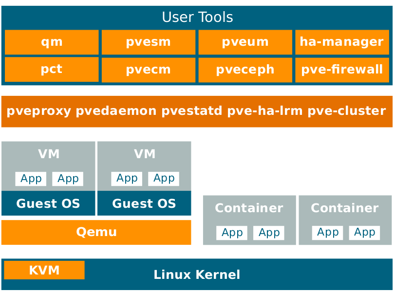

Introducción
=============

Proxmox VE es una plataforma para ejecutar máquinas virtuales y contenedores. Está basado en Debian Linux, y completamente
fuente abierta. Para lograr la máxima flexibilidad, implementamos dos tecnologías de virtualización: Virtual basada en Kernel
Máquina (KVM) y virtualización basada en contenedor (LXC).
Uno de los objetivos principales del diseño era hacer que la administración fuera lo más fácil posible. Puede utilizar Proxmox VE en un nodo único, o ensamblar un clúster de muchos nodos. Todas las tareas de gestión se pueden realizar utilizando nuestro sitio web. interfaz de administración, e incluso un usuario novato puede configurar e instalar Proxmox VE en minutos.

1.1 Central Management
++++++++++++++++++++

**Diseño único multi-maestro**

La interfaz de administración basada en web integrada le brinda una visión general clara de todos sus invitados KVM y contenedores de Linux e incluso de todo tu cluster. Puede administrar fácilmente sus máquinas virtuales y tainers, almacenamiento o cluster desde la GUI. No hay necesidad de instalar un separado, complejo y costoso servidor de gestión.

**Proxmox Cluster File System (pmxcfs)**

Proxmox VE utiliza el exclusivo sistema de archivos Proxmox Cluster (pmxcfs), un sistema de archivos basado en bases de datos para
Almacenamiento de archivos de configuración. Esto le permite almacenar la configuración de miles de máquinas virtuales.
Al utilizar corosync, estos archivos se replican en tiempo real en todos los nodos del clúster. El sistema de archivos almacena
todos los datos dentro de una base de datos persistente en el disco, sin embargo, una copia de los datos reside en la RAM que
El tamaño máximo de almacenamiento es de 30 MB, más que suficiente para miles de máquinas virtuales.
Proxmox VE es la única plataforma de virtualización que usa este sistema de archivos de clúster único.

**Interfaz de gestión basada en web**

Proxmox VE es fácil de usar. Las tareas de gestión se pueden realizar a través de la gestión web incluida Interfaz de administración: no es necesario instalar una herramienta de administración por separado ni ninguna otra administración adicional.
nodo con enormes bases de datos. La herramienta multi-master le permite administrar todo su clúster desde cualquier
nodo de su cluster. La gestión centralizada basada en web, basada en el marco de JavaScript (ex-tJS): le permite controlar todas las funcionalidades de la interfaz gráfica de usuario (GUI, por sus siglas en inglés) y el historial general y los registros de cada uno
nodo único. Esto incluye la ejecución de tareas de copia de seguridad o restauración, migración activa o actividades activadas de alta disponibilidad.

**Línea de comando**

Para usuarios avanzados que están acostumbrados a la comodidad del shell de Unix o Windows Powershell, Proxmox
VE proporciona una interfaz de línea de comandos para administrar todos los componentes de su entorno virtual. Esta
La interfaz de la línea de comandos tiene una finalización inteligente de pestañas y documentación completa en forma de UNIX man
páginas
API REST
Proxmox VE utiliza una API RESTful. Elegimos JSON como formato de datos primario, y toda la API es para Definitivamente definido utilizando el esquema JSON. Esto permite una integración rápida y fácil para la gestión de terceros.
Herramientas como entornos de alojamiento personalizados.

**Administración basada en roles**

Puede definir el acceso granular para todos los objetos (como máquinas virtuales, almacenes, nodos, etc.) utilizando el rol basado en Gestión de usuarios y permisos. Esto le permite definir privilegios y le ayuda a controlar Acceso a objetos. Este concepto también se conoce como listas de control de acceso: cada permiso especifica una
asunto (un usuario o grupo) y un rol (conjunto de privilegios) en una ruta específica.

**Roles de autentificación**

Proxmox VE admite múltiples fuentes de autenticación como Microsoft Active Directory, LDAP, Linux PAM autenticación estándar o el servidor de autenticación Proxmox VE incorporado.

1.2 Flexible Storage
++++++++++++++++++++

El modelo de almacenamiento Proxmox VE es muy flexible. Las imágenes de máquinas virtuales pueden almacenarse en uno o varios almacenes locales o en almacenamiento compartido como NFS y en SAN. No hay límites, puedes configurar como muchas definiciones de almacenamiento que desee. Puede usar todas las tecnologías de almacenamiento disponibles para Debian Linux.
Una de las principales ventajas de almacenar máquinas virtuales en almacenamiento compartido es la capacidad de migrar en vivo las máquinas en ejecución sin cualquier tiempo de inactividad, ya que todos los nodos del clúster tienen acceso directo a las imágenes de disco de la máquina virtual.
Actualmente admitimos los siguientes tipos de almacenamiento en red:

• Grupo LVM (respaldo de red con objetivos iSCSI)
• objetivo iSCSI
• NFS Share
• Compartir CIFS
• Ceph RBD
• Utilizar directamente iSCSI LUNs
• GlusterFS

Los tipos de almacenamiento local soportados son:

• Grupo LVM (dispositivos de respaldo locales como dispositivos de bloque, dispositivos FC, DRBD, etc.)
• Directorio (almacenamiento en sistema de archivos existente)
• ZFS

1.3 Integrated Backup and Restore
++++++++++++++++++++++++++++++++++

La herramienta de copia de seguridad integrada (vzdump) crea snapshots consistentes de los contenedores en ejecución y los invitados KVM.
Básicamente, crea un archivo de datos de VM o CT que incluye los archivos de configuración de VM/CT.
KVM live backup funciona para todos los tipos de almacenamiento, incluidas las imágenes de VM en NFS, CIFS, iSCSI LUN, Ceph RBD o
Sheepdog. El nuevo formato de copia de seguridad está optimizado para almacenar copias de seguridad de VM de forma rápida y efectiva (archivos dispersos,de datos de pedido, minimización de E/S).

1.4 High Availability Cluster
+++++++++++++++++++++++++++++

Un Proxmox VE HA Cluster de múltiples nodos permite la definición de servidores virtuales de alta disponibilidad. El Proxmox
VE HA Cluster se basa en tecnologías comprobadas de Linux HA, proporcionando servicios de HA estables y confiables.

1.5 Flexible Networking
+++++++++++++++++++++++

Proxmox VE utiliza un modelo de red puente. Todas las máquinas virtuales pueden compartir un puente como si fueran cables de red virtuales.
De cada invitado todos fueron enchufados en el mismo interruptor. Para conectar máquinas virtuales al mundo exterior, puentes.
Se adjuntan a las tarjetas de red físicas asignadas una configuración TCP/IP.
Para una mayor flexibilidad, son posibles las VLAN (IEEE 802.1q) y la vinculación/agregación de la red. De esta manera es
posible construir redes virtuales complejas y flexibles para los hosts de Proxmox VE, aprovechando todo el poder del Pila de red de Linux.

1.6 Integrated Firewall
++++++++++++++++++++++++

El firewall integrado le permite filtrar paquetes de red en cualquier VM o interfaz de contenedor. Conjuntos comunes
Las reglas de firewall se pueden agrupar en "grupos de seguridad".

1.7 Why Open Source
+++++++++++++++++++++

Proxmox VE utiliza un kernel de Linux y se basa en la distribución Debian GNU/Linux. El código fuente de Proxmox VE se publica bajo la Licencia Pública General de GNU Affero, versión 3. Esto significa que usted es libre de inspeccionar el código fuente en cualquier momento o contribuir al proyecto usted mismo.
En Proxmox nos comprometemos a utilizar software de código abierto siempre que sea posible. Usando software de código abierto
garantiza acceso completo a todas las funcionalidades, así como alta seguridad y confiabilidad. Pensamos que todos
debe tener el derecho de acceder al código fuente de un software para ejecutarlo, construirlo o enviar cambios de nuevo
al proyecto. Se alienta a todos a contribuir, mientras que Proxmox garantiza que el producto siempre cumple Criterios de calidad profesional.
El software de código abierto también ayuda a mantener sus costos bajos y hace que su infraestructura central sea independiente
de un solo vendedor.

1.8 Your benefit with Proxmox VE
++++++++++++++++++++++++++++++++

• Software de código abierto
• No hay bloqueo de proveedores
• kernel de linux
• Instalación rápida y fácil de usar
• Interfaz de gestión basada en web
• API REST
• Gran comunidad activa
• Bajos costos de administración y despliegue simple

1.10 Project History
+++++++++++++++++++++

El proyecto comenzó en 2007, seguido de una primera versión estable en 2008. En el momento en que usamos OpenVZ para contenedores, y KVM para máquinas virtuales. Las características de agrupamiento fueron limitadas, y la interfaz de usuario fue simple (página web generada por el servidor).
Pero rápidamente desarrollamos nuevas funciones utilizando la pila de clústeres de Corosync y la introducción de la nueva El sistema de archivos de clúster de Proxmox (pmxcfs) fue un gran paso hacia adelante, ya que oculta por completo la composición del clúster.
Complejidad del usuario. La administración de un grupo de 16 nodos es tan simple como la administración de un solo nodo. Guía de administración de Proxmox VE

También presentamos una nueva API REST, con una especificación declarativa completa escrita en el esquema JSON.
Esto permitió a otras personas integrar Proxmox VE en su infraestructura, y facilitó la provisión de servicios adicionales.
Además, la nueva API REST permitió reemplazar la interfaz de usuario original con un HTML5 moderno Aplicación utilizando JavaScript. También reemplazamos el antiguo código de consola VNC basado en Java con noVNC. Asi que solo necesita un navegador web para administrar sus máquinas virtuales.
El soporte para varios tipos de almacenamiento es otra gran tarea. En particular, Proxmox VE fue la primera distribución a
ZFS en Linux por defecto en 2014. Otro hito fue la capacidad de ejecutar y administrar el almacenamiento Ceph en Los nodos del hipervisor. Tales configuraciones son extremadamente rentables.
Cuando comenzamos, estábamos entre las primeras empresas que proporcionaban soporte comercial para KVM. El KVM
El proyecto en sí evolucionó continuamente, y ahora es un hipervisor ampliamente utilizado. Nuevas características llegan con cada uno lanzamiento. Desarrollamos la función de copia de seguridad en vivo KVM, que hace posible crear copias de seguridad de instantáneas en Cualquier tipo de almacenamiento.
El cambio más notable con la versión 4.0 fue el cambio de OpenVZ a LXC. Los contenedores son ahora profundamente integrados, y pueden usar las mismas funciones de almacenamiento y red que las máquinas virtuales.

