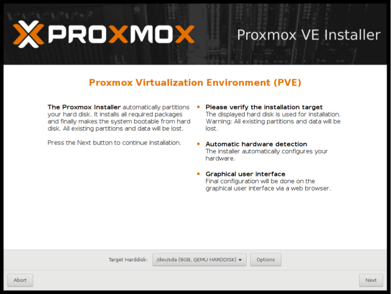

Instalar Proxmox VE
===================

Proxmox VE está basado en Debian y viene con un CD-ROM de instalación que incluye un Debian completo sistema ("stretch" para la versión 5.x) así como todos los paquetes Proxmox VE necesarios.
El instalador solo le hace algunas preguntas, luego particiona el(los) disco(s) local(es), instala todos los paquetes requeridos,
y configura el sistema incluyendo una configuración de red básica. Puede obtener un sistema totalmente funcional dentro de un
pocos minutos. Este es el método de instalación preferido y recomendado.
**Alternativamente, Proxmox VE puede instalarse sobre un sistema Debian existente. Esta opción solo es Recomendado para usuarios avanzados, ya que es necesario un conocimiento detallado de Proxmox VE.**

2.1 System Requirements
+++++++++++++++++++++++

Para servidores de producción, se necesita equipo de servidor de alta calidad. Tenga en cuenta, si ejecuta 10 servidores virtuales
en una máquina y luego experimenta una falla de hardware, se pierden 10 servicios. Soportes Proxmox VE clustering, esto significa que múltiples instalaciones de Proxmox VE pueden ser administradas centralmente gracias a los
Funcionalidad de cluster.
Proxmox VE puede usar almacenamiento local (DAS), SAN, NAS y también almacenamiento distribuido (Ceph RBD). Para detalles
ver capítulo de almacenamiento

2.1.2 Recommended System Requirements
+++++++++++++++++++++++++++++++++++++

• CPU: 64 bits (Intel EMT64 o AMD64), se recomienda una CPU con varios núcleos
• CPU / placa base con capacidad Intel VT / AMD-V para soporte de virtualización completa KVM
• RAM: 8 GB de RAM, más RAM adicional utilizada para los huéspedes
• RAID de hardware con caché de escritura protegida de baterías (“BBU”) o protección basada en flash
• Discos duros rápidos, mejores resultados con 15k rpm SAS, Raid10
• Al menos dos NIC, dependiendo de la tecnología de almacenamiento utilizada, necesitará más

2.1.3 Simple Performance Overview
++++++++++++++++++++++++++++++++++++

En un sistema Proxmox VE instalado, puede ejecutar el script **pveperf** incluido para obtener una visión general de la CPU y rendimiento del disco duro.

Nota	
	Esto es solo un punto de referencia muy rápido y general. Se recomiendan pruebas más detalladas, especialmente en lo que respecta a Ingrese el rendimiento de E/S de su sistema.

2.1.4 Supported web browsers for accessing the web interface
++++++++++++++++++++++++++++++++++++++++++++++++++++++++++++

Para usar la interfaz web necesitas un navegador moderno, que incluye:
• Firefox, una versión del año en curso o la última versión de soporte ampliado
• Chrome, un lanzamiento del año en curso.
• las versiones de Internet Explorer compatibles actualmente de Microsoft (a partir de 2016, esto significa IE 11 o IE Edge)
• las versiones de Safari admitidas actualmente por Apple (a partir de 2016, esto significa Safari 9)
Si Proxmox VE detecta que te estás conectando desde un dispositivo móvil, serás redirigido a una pantalla táctil liviana.
UI basada.

2.2 Using the Proxmox VE Installation CD-ROM
+++++++++++++++++++++++++++++++++++++++++++++

Puede descargar la ISO desde http://www.proxmox.com. Incluye lo siguiente:
• Sistema operativo completo (Debian Linux, 64-bit)
• El instalador Proxmox VE, que particiona los discos duros con ext4, ext3, xfs o ZFS e instala los sistema operativo.
• Proxmox VE kernel (Linux) con LXC y KVM supportProxmox VE Guía de administración
• Conjunto de herramientas completo para administrar máquinas virtuales, contenedores y todos los recursos necesarios
• Interfaz de administración basada en web para usar el conjunto de herramientas

Nota
	De forma predeterminada, se utiliza el servidor completo y se eliminan todos los datos existentes.

Inserte el CD-ROM de instalación y luego arranque desde esa unidad. Inmediatamente después usted puede elegir las siguientes opciones de menú:

**Instalar Proxmox VE**
Iniciar la instalación normal.

**Instalar Proxmox VE (modo de depuración)**
Iniciar la instalación en modo de depuración. Abre una consola shell en varios pasos de instalación, para que usted
puede depurar cosas si algo sale mal. Presione CTRL-D para salir de las consolas de depuración y continuar la instalación Esta opción es principalmente para desarrolladores y no para uso general.

**Boot de rescate**
Esta opción le permite iniciar una instalación existente. Busca en todos los discos duros adjuntos y, si encuentra
una instalación existente, arranca directamente en ese disco usando el kernel de Linux existente. Esto puede ser útil
si hay problemas con el bloque de inicio (grub), o el BIOS no puede leer el bloque de inicio de la
disco.

**Memoria de prueba**
 Ejecuta memtest86 +. Esto es útil para verificar si su memoria es funcional y está libre de errores.

Normalmente, selecciona Instalar Proxmox VE para iniciar la instalación. Después de eso se le pedirá que seleccione la disco duro de destino (s). El botón Opciones le permite seleccionar el sistema de archivos de destino, que por defecto es ext4. El instalador utiliza LVM si selecciona ext3, ext4 o xfs como sistema de archivos, y ofrece una opción adicional para restringir Espacio LVM.

Si tiene más de un disco, también puede usar ZFS como sistema de archivos. ZFS soporta varios programas RAID
niveles, por lo que es especialmente útil si no tiene un controlador RAID de hardware. El botón Opciones permite
selecciona el nivel RAID de ZFS y puede elegir los discos allí.

La siguiente página solo solicita opciones de configuración básicas como su ubicación, la zona horaria y la distribución del teclado.
La ubicación se utiliza para seleccionar un servidor de descarga cercano para acelerar las actualizaciones. El instalador suele ser capaz
para detectar automáticamente la configuración, por lo que solo necesita cambiarlos en situaciones excepcionales cuando la detección automática falla, o cuando desee usar una distribución de teclado especial que no se usa comúnmente en su país.

A continuación, debe especificar una dirección de correo electrónico y la contraseña del superusuario (root). La contraseña debe tener en
menos de 5 caracteres, pero recomendamos encarecidamente usar contraseñas más seguras; aquí hay algunas pautas:
• Use una longitud de contraseña mínima de 12 a 14 caracteres.
• Incluya caracteres alfabéticos en minúsculas y mayúsculas, números y símbolos.
• Evite la repetición de caracteres, patrones de teclado, palabras del diccionario, secuencias de letras o números, nombres de usuario,
nombres relativos o de mascotas, enlaces románticos (actuales o pasados) e información biográfica (por ejemplo, números de identificación,
nombres o fechas de los antepasados).
A veces es necesario enviar una notificación al administrador del sistema, por ejemplo:
• Información sobre actualizaciones de paquetes disponibles.
• Mensajes de error de trabajos CRON periódicos.
Todos esos correos de notificación se enviarán a la dirección de correo electrónico especificada.

El último paso es la configuración de la red. Tenga en cuenta que puede utilizar IPv4 o IPv6 aquí, pero no ambos. Si desea configurar un nodo de doble pila, puede hacerlo fácilmente después de la instalación.

Si presiona Siguiente ahora, la instalación comienza a formatear los discos y copia los paquetes al destino. por favor espera Hasta que termine, reinicie el servidor.
La configuración adicional se realiza a través de la interfaz web de Proxmox. Simplemente apunte su navegador a la dirección IP dada
durante la instalación (https://youripaddress:8006).

Nota
	El inicio de sesión predeterminado es "root" (realm PAM) y la contraseña de root se define durante el proceso de instalación.

2.2.1 Advanced LVM Configuration Options
++++++++++++++++++++++++++++++++++++++++++

El instalador crea un Grupo de volúmenes (VG) llamado pve, y volúmenes lógicos adicionales (LVs) llamados root, Datos e intercambio. El tamaño de esos volúmenes se puede controlar con:

**hdsize**
Define el tamaño total de HD a utilizar. De esta manera puede ahorrar espacio libre en el HD para más particiones.
ing (es decir, para un PV y VG adicionales en el mismo disco duro que se puede usar para el almacenamiento de LVM).

**swapsize**
Define el tamaño del volumen de intercambio. El valor predeterminado es el tamaño de la memoria instalada, mínimo 4 GB
y máximo 8 GB. El valor resultante no puede ser mayor que hdsize / 8 .Proxmox VE Administration Guide

Nota
	Si se establece en 0, no se creará ningún volumen de intercambio.

**maxroot**
Define el tamaño máximo del volumen raíz, que almacena el sistema operativo. El maximo
El límite del tamaño del volumen raíz es hdsize / 4.

**maxvz**
Define el tamaño máximo del volumen de datos. El tamaño real del volumen de datos es::
datasize = hdsize - rootsize - swapsize - minfree
Donde el tamaño de datos no puede ser mayor que maxvz.

Nota
	En el caso de LVM thin, el grupo de datos solo se creará si el tamaño de datos es mayor que 4GB.
Nota
	Si se establece en 0, no se creará un volumen de datos y la configuración de almacenamiento se adaptará en consecuencia.

**minfree**
Define la cantidad de espacio libre que queda en el grupo de volúmenes LVM pve. Con más de 128GB de almacenamiento.
disponible, el valor predeterminado es 16 GB, de lo contrario se utilizará hdsize / 8.

Nota
	LVM requiere espacio libre en el VG para sn

2.2.2 ZFS Performance Tips
+++++++++++++++++++++++++

ZFS uses a lot of memory, so it is best to add additional RAM if you want to use ZFS. A good calculation is 4GB plus 1GB RAM for each TB RAW disk space.
ZFS also provides the feature to use a fast SSD drive as write cache. The write cache is called the ZFS Intent Log (ZIL). You can add that after installation using the following command::
zpool add <pool-name> log </dev/path_to_fast_ssd>

2.3 Install Proxmox VE on Debian
+++++++++++++++++++++++++++++++++

Proxmox VE se envía como un conjunto de paquetes Debian, por lo que puede instalarlo sobre una instalación normal de Debian.
Después de configurar los repositorios, necesita ejecutar:: 
	apt-get update
	apt-get install proxmox-ve

La instalación sobre una instalación existente de Debian parece fácil, pero supone que se ha instalado correctamente el sistema base, y usted sabe cómo desea configurar y utilizar el almacenamiento local. Configuración de la red También es completamente de usted.
En general, esto no es trivial, especialmente cuando utiliza LVM o ZFS.
Puede encontrar instrucciones detalladas paso a paso en la wiki.

2.4 Install from USB Stick
++++++++++++++++++++++++++++

Para iniciar el medio de instalación, copie la imagen ISO en un medio USB.
Primero descargue la imagen ISO de https://www.proxmox.com/en/downloads/category/iso-images-pve Necesita al menos un dispositivo USB de 1 GB.

Nota
	Usar UNetbootin o Rufus no funciona.

2.4.2 Instructions for GNU/Linux
+++++++++++++++++++++++++++++++++

Simplemente puede usar dd en sistemas similares a UNIX. Primero descargue la imagen ISO, luego conecte la memoria USB. Tú debe averiguar qué nombre de dispositivo se asigna a la memoria USB (consulte a continuación). Entonces corre::
dd if=proxmox-ve_*.iso of=/dev/XYZ bs=1M

Nota
	Asegúrese de reemplazar /dev/XYZ con el nombre de dispositivo correcto.

Find Correct USB Device Name
++++++++++++++++++++++++++++

Puede comparar las últimas líneas del comando dmesg antes y después de la inserción, o usar el comando lsblk.
Abre una terminal y ejecuta::
lsblk

Luego conecte su dispositivo USB y vuelva a ejecutar el comando::
lsblk

Aparecerá un nuevo dispositivo, y este es el dispositivo USB que desea utilizar.

